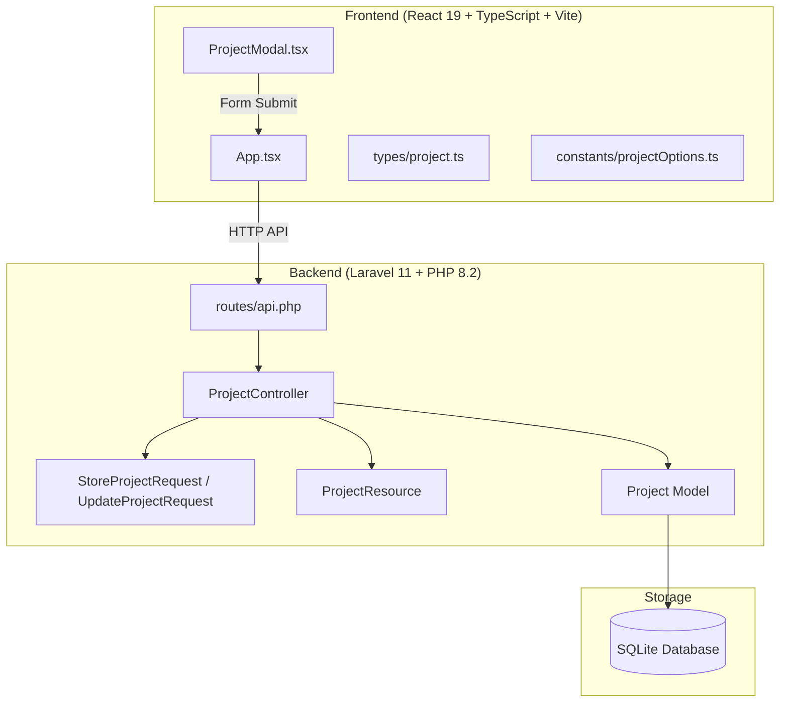
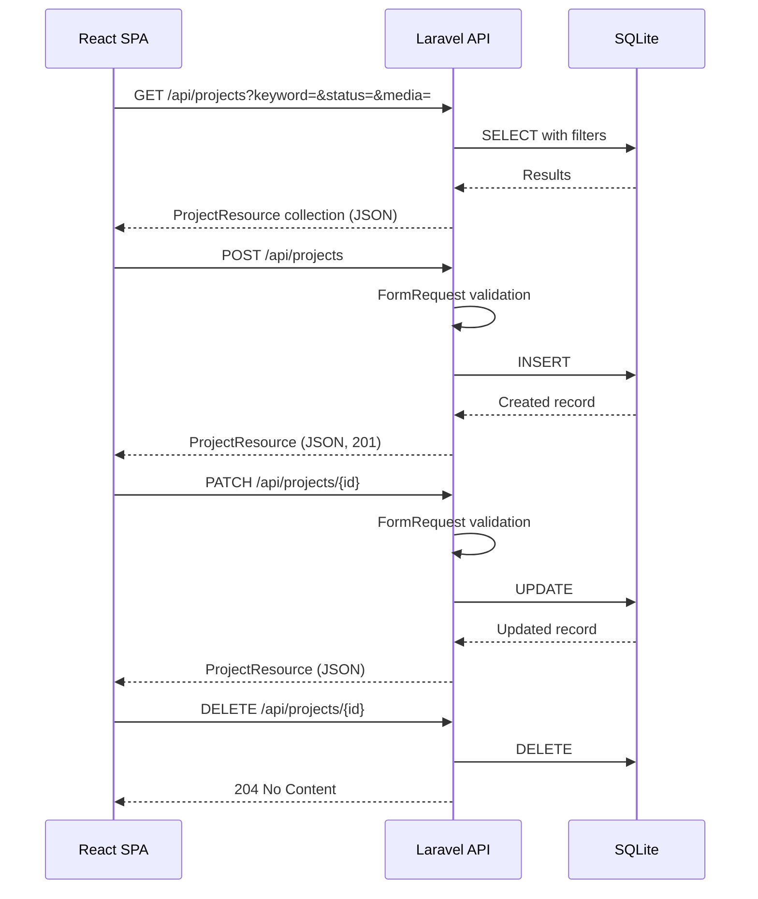

# Design Document: Side Project Manager

## Overview

副業案件管理Webアプリケーション（Phase 1）の技術設計書。Laravel 11をバックエンド、React 19 + TypeScript + Tailwind CSSをフロントエンドとするSPA構成で、フリーランス案件のCRUD管理を実現する。

本アプリは単一ページ構成（React Router不使用）で、モーダルベースの登録・編集UIとテーブルベースの一覧表示を中心とした業務ツールである。

### 設計方針

- 標準的なLaravel 11 / React 19のscaffoldをベースに構築
- 不要な抽象化レイヤー（Repository、Service、DTO）を排除
- Controller + FormRequest + Resource + Model のLaravel標準パターンに従う
- フロントエンドは最小構成から開始し、必要に応じて分割

## Architecture

### 高レベルアーキテクチャ



### リクエストフロー



## Components and Interfaces

### バックエンド構成

#### ProjectController

```php
class ProjectController extends Controller
{
    public function index(Request $request): AnonymousResourceCollection
    public function store(StoreProjectRequest $request): ProjectResource
    public function update(UpdateProjectRequest $request, Project $project): ProjectResource
    public function destroy(Project $project): Response
}
```

- `index`: keyword, status, media クエリパラメータによるフィルタリング
- `store`: 新規案件登録（バリデーション付き）
- `update`: 既存案件更新（バリデーション付き）
- `destroy`: 案件削除

#### StoreProjectRequest / UpdateProjectRequest

```php
// StoreProjectRequest
public function rules(): array
{
    return [
        'name' => ['required', 'string', 'max:255'],
        'status' => ['required', 'string', 'in:未応募,応募済み,返信待ち,...'],
        'project_url' => ['nullable', 'url', 'max:2048'],
        'reward' => ['nullable', 'integer', 'min:0'],
        'applied_date' => ['nullable', 'date'],
        'next_action_date' => ['nullable', 'date'],
        'applicant_count' => ['nullable', 'integer', 'min:0'],
        'recruitment_count' => ['nullable', 'integer', 'min:0'],
        'is_favorite' => ['nullable', 'boolean'],
        // other nullable string fields...
    ];
}
```

UpdateProjectRequestは同一ルールだが、全フィールドを`sometimes`で囲む（PATCH対応）。

#### ProjectResource

```php
class ProjectResource extends JsonResource
{
    public function toArray(Request $request): array
    {
        return [
            'id' => $this->id,
            'name' => $this->name,
            'project_url' => $this->project_url,
            'client_name' => $this->client_name,
            'media' => $this->media,
            'category' => $this->category,
            'applied_date' => $this->applied_date,
            'status' => $this->status,
            'reward' => $this->reward,
            'working_hours' => $this->working_hours,
            'applicant_count' => $this->applicant_count,
            'recruitment_count' => $this->recruitment_count,
            'application_text' => $this->application_text,
            'next_action' => $this->next_action,
            'next_action_date' => $this->next_action_date,
            'memo' => $this->memo,
            'priority' => $this->priority,
            'is_favorite' => $this->is_favorite,
            'created_at' => $this->created_at,
            'updated_at' => $this->updated_at,
        ];
    }
}
```

### フロントエンド構成

#### 初期構成（最小限）

| ファイル                      | 責務                                                                                               |
| ----------------------------- | -------------------------------------------------------------------------------------------------- |
| `App.tsx`                     | メインコンポーネント。ヘッダー、サマリーカード、検索フィルタ、次アクション、案件テーブルを全て含む |
| `ProjectModal.tsx`            | 登録・編集共用モーダル。mode props (`create` / `edit`) で動作切り替え                              |
| `types/project.ts`            | Project型定義、APIレスポンス型                                                                     |
| `constants/projectOptions.ts` | ステータス一覧、媒体一覧、カラーマッピング定数                                                     |

#### App.tsx の責務

```typescript
// State management
const [projects, setProjects] = useState<Project[]>([]);
const [keyword, setKeyword] = useState("");
const [statusFilter, setStatusFilter] = useState("");
const [mediaFilter, setMediaFilter] = useState("");
const [modalOpen, setModalOpen] = useState(false);
const [editingProject, setEditingProject] = useState<Project | null>(null);

// API calls
const fetchProjects = async () => {
  /* GET /api/projects with params */
};
const handleCreate = async (data: ProjectFormData) => {
  /* POST */
};
const handleUpdate = async (id: number, data: ProjectFormData) => {
  /* PATCH */
};
const handleDelete = async (id: number) => {
  /* window.confirm + DELETE */
};

// Derived data (computed from projects state)
const summaryData = useMemo(() => computeSummary(projects), [projects]);
const nextActions = useMemo(() => computeNextActions(projects), [projects]);
```

#### ProjectModal.tsx

```typescript
interface ProjectModalProps {
  open: boolean;
  mode: "create" | "edit";
  project?: Project | null;
  onClose: () => void;
  onSubmit: (data: ProjectFormData) => void;
}
```

- `mode='create'`: フォーム初期値は空/デフォルト
- `mode='edit'`: フォーム初期値は既存project data
- バリデーション: 案件名必須チェック（フロント側）

### API仕様

#### GET /api/projects

| パラメータ | 型                | 説明                           |
| ---------- | ----------------- | ------------------------------ |
| keyword    | string (optional) | 案件名またはメモで部分一致検索 |
| status     | string (optional) | ステータスで完全一致絞り込み   |
| media      | string (optional) | 媒体で完全一致絞り込み         |

**レスポンス**: `{ data: Project[] }`

#### POST /api/projects

**リクエストボディ**: ProjectFormData（name必須、status必須）

**レスポンス**: `{ data: Project }` (201)

**エラー**: `422` バリデーションエラー時

#### PATCH /api/projects/{id}

**リクエストボディ**: Partial<ProjectFormData>

**レスポンス**: `{ data: Project }` (200)

**エラー**: `404` 存在しないID、`422` バリデーションエラー

#### DELETE /api/projects/{id}

**レスポンス**: `204 No Content`

**エラー**: `404` 存在しないID

## Data Models

### projects テーブル

```sql
CREATE TABLE projects (
    id INTEGER PRIMARY KEY AUTOINCREMENT,
    name VARCHAR(255) NOT NULL,
    project_url VARCHAR(2048) NULL,
    client_name VARCHAR(255) NULL,
    media VARCHAR(255) NULL,
    category VARCHAR(255) NULL,
    applied_date DATE NULL,
    status VARCHAR(255) NOT NULL DEFAULT '未応募',
    reward INTEGER NULL,
    working_hours VARCHAR(255) NULL,
    applicant_count INTEGER NULL,
    recruitment_count INTEGER NULL,
    application_text TEXT NULL,
    next_action VARCHAR(255) NULL,
    next_action_date DATE NULL,
    memo TEXT NULL,
    priority VARCHAR(255) NULL,
    is_favorite BOOLEAN NOT NULL DEFAULT FALSE,
    created_at TIMESTAMP NULL,
    updated_at TIMESTAMP NULL
);
```

### TypeScript型定義

```typescript
// types/project.ts
export interface Project {
  id: number;
  name: string;
  project_url: string | null;
  client_name: string | null;
  media: string | null;
  category: string | null;
  applied_date: string | null;
  status: string;
  reward: number | null;
  working_hours: string | null;
  applicant_count: number | null;
  recruitment_count: number | null;
  application_text: string | null;
  next_action: string | null;
  next_action_date: string | null;
  memo: string | null;
  priority: string | null;
  is_favorite: boolean;
  created_at: string;
  updated_at: string;
}

export interface ProjectFormData {
  name: string;
  project_url?: string;
  client_name?: string;
  media?: string;
  category?: string;
  applied_date?: string;
  status: string;
  reward?: number | null;
  working_hours?: string;
  applicant_count?: number | null;
  recruitment_count?: number | null;
  application_text?: string;
  next_action?: string;
  next_action_date?: string;
  memo?: string;
  priority?: string;
  is_favorite?: boolean;
}
```

### 定数定義

```typescript
// constants/projectOptions.ts
export const STATUS_OPTIONS = [
  "未応募",
  "応募済み",
  "返信待ち",
  "面談予定",
  "選考中",
  "契約済み",
  "作業中",
  "納品済み",
  "検収待ち",
  "完了",
  "不採用",
  "辞退",
] as const;

export const MEDIA_OPTIONS = [
  "CrowdWorks",
  "MENTA",
  "Lancers",
  "その他",
] as const;

export const STATUS_COLORS: Record<string, string> = {
  未応募: "gray",
  応募済み: "slate",
  返信待ち: "amber",
  面談予定: "blue",
  選考中: "indigo",
  契約済み: "violet",
  作業中: "cyan",
  納品済み: "sky",
  検収待ち: "orange",
  完了: "green",
  不採用: "red",
  辞退: "gray",
};
```

### フロントエンド計算ロジック

```typescript
// Summary calculation (in App.tsx or utility)
function computeSummary(projects: Project[]) {
  return {
    total: projects.length,
    interview: projects.filter((p) => p.status === "面談予定").length,
    waiting: projects.filter((p) => p.status === "返信待ち").length,
    contracted: projects.filter((p) => p.status === "契約済み").length,
    completed: projects.filter((p) => p.status === "完了").length,
  };
}

// Next actions (in App.tsx or utility)
function computeNextActions(projects: Project[]) {
  return projects
    .filter((p) => p.next_action_date !== null)
    .sort((a, b) => a.next_action_date!.localeCompare(b.next_action_date!));
}
```

## ファイル構成

### scaffold ファイル vs カスタムファイル

```
project-root/
├── app/
│   ├── Http/
│   │   ├── Controllers/
│   │   │   └── ProjectController.php        ★ custom
│   │   └── Requests/
│   │       ├── StoreProjectRequest.php      ★ custom
│   │       └── UpdateProjectRequest.php     ★ custom
│   └── Models/
│       └── Project.php                       ★ custom
├── database/
│   └── migrations/
│       └── xxxx_create_projects_table.php   ★ custom
├── routes/
│   └── api.php                              ★ edited (add project routes)
├── resources/
│   └── js/
│       ├── app.tsx                           ★ custom (entry point)
│       ├── App.tsx                           ★ custom (main component)
│       ├── ProjectModal.tsx                  ★ custom
│       ├── types/
│       │   └── project.ts                   ★ custom
│       └── constants/
│           └── projectOptions.ts            ★ custom
├── tests/
│   └── Feature/
│       └── ProjectApiTest.php               ★ custom
├── vite.config.ts                           (scaffold, edited for React)
├── tailwind.config.js                       (scaffold, minimal config)
├── tsconfig.json                            (scaffold)
├── package.json                             (scaffold, edited for deps)
├── composer.json                            (scaffold)
├── .env                                     (scaffold, DB_CONNECTION=sqlite)
└── ... (other standard Laravel scaffold files)
```

★ = Phase 1で追加・編集するファイル（約15ファイル）

### 設計判断とその根拠

| 判断                             | 根拠                                                  |
| -------------------------------- | ----------------------------------------------------- |
| Repository/Service層なし         | CRUD中心でビジネスロジックが薄い。Controllerで十分    |
| React Router不使用               | 単一ページ構成。ルーティング不要                      |
| フロントでサマリー計算           | 全案件を既にfetchしているため、追加APIコール不要      |
| window.confirm()で削除確認       | カスタムダイアログコンポーネント不要。Phase 1の簡素化 |
| SQLite                           | Phase 1はシングルユーザー。セットアップ最小限         |
| 最小コンポーネント分割           | App.tsx + ProjectModal.tsx で開始。肥大化時のみ分割   |
| FormRequest でバリデーション     | Laravel標準。Controller の責務を分離                  |
| ProjectResource でレスポンス整形 | API出力形式の統一。将来の変更に対応しやすい           |

## Correctness Properties

_A property is a characteristic or behavior that should hold true across all valid executions of a system—essentially, a formal statement about what the system should do. Properties serve as the bridge between human-readable specifications and machine-verifiable correctness guarantees._

### Property 1: Search filter is a subset

_For any_ set of projects and any keyword string, the result of filtering by keyword SHALL be a subset of the original project list, and every returned project SHALL contain the keyword (case-insensitive) in its name or memo field. Additionally, when keyword is empty, all projects SHALL be returned.

**Validates: Requirements 3.2, 3.3**

### Property 2: Status filter correctness

_For any_ set of projects and any valid status value, the result of filtering by status SHALL contain only projects whose status exactly matches the filter value, and the result SHALL include all such projects from the original list.

**Validates: Requirements 4.3**

### Property 3: Media filter correctness

_For any_ set of projects and any valid media value, the result of filtering by media SHALL contain only projects whose media field exactly matches the filter value, and the result SHALL include all such projects from the original list.

**Validates: Requirements 4.4**

### Property 4: Combined filters are AND conjunction

_For any_ set of projects and any combination of keyword, status, and media filters, the result SHALL equal the intersection of applying each filter independently.

**Validates: Requirements 4.5**

### Property 5: Summary counts are consistent with data

_For any_ set of projects, the summary total SHALL equal the length of the project array, and each status-specific count (面談予定, 返信待ち, 契約済み, 完了) SHALL equal the number of projects with that exact status value in the array.

**Validates: Requirements 9.1, 9.2, 9.3, 9.4, 9.5**

### Property 6: Next actions are filtered and sorted

_For any_ set of projects, the computed next actions list SHALL contain only projects with a non-null next_action_date, and SHALL be sorted in ascending order by next_action_date.

**Validates: Requirements 7.1**

### Property 7: Validation rejects empty name

_For any_ project form data where name is empty or whitespace-only, the API SHALL return a 422 validation error and NOT create a record in the database.

**Validates: Requirements 1.4, 12.6**

### Property 8: CRUD round trip preservation

_For any_ valid project data, creating a project via POST and then retrieving it via GET SHALL return a project with all the same field values as the original input.

**Validates: Requirements 1.5, 12.2, 12.3**

## Error Handling

### バックエンド

| エラー種別           | HTTPステータス | レスポンス形式                                                 |
| -------------------- | -------------- | -------------------------------------------------------------- |
| バリデーションエラー | 422            | `{ message: string, errors: { field: string[] } }`             |
| リソース未検出       | 404            | `{ message: "Not Found" }`                                     |
| サーバーエラー       | 500            | `{ message: "Server Error" }` (本番ではスタックトレース非表示) |

- Laravel標準のException Handler を使用
- FormRequestのバリデーション失敗は自動的に422レスポンス
- Model Bindingの失敗は自動的に404レスポンス

### フロントエンド

- API呼び出し失敗時: try/catchで捕捉し、ユーザーにalertまたはエラーメッセージ表示
- ネットワークエラー: 汎用エラーメッセージ表示
- バリデーションエラー（422）: APIレスポンスのerrorsオブジェクトを解析し、各フィールドにエラー表示
- 楽観的更新は行わない（Phase 1ではシンプルにAPIレスポンス後に状態更新）

## Testing Strategy

### テストアプローチ

Phase 1では新規テストライブラリ（fast-check等）を導入しない。テストは以下の2つのレベルで実施:

1. **Laravel Feature Tests** (PHPUnit): API CRUD操作の結合テスト
2. **フロントエンド検証**: TypeScriptコンパイル + ビルド成功 + 手動動作確認

### Laravel Feature Tests (`tests/Feature/ProjectApiTest.php`)

```
- POST /api/projects: 正常登録 (201)
- POST /api/projects: 必須フィールド未入力 (422)
- GET /api/projects: 全件取得
- GET /api/projects?keyword=xxx: キーワード検索
- GET /api/projects?status=xxx: ステータスフィルタ
- GET /api/projects?media=xxx: 媒体フィルタ
- PATCH /api/projects/{id}: 更新成功
- DELETE /api/projects/{id}: 削除成功 (204)
- DELETE /api/projects/{id}: 存在しないID (404)
```

### フロントエンド検証

Phase 1ではproperty-based testingを導入せず、以下を確認する:

- TypeScriptの型エラーがないこと
- `npm run build` が成功すること
- サマリー計算が正しく動作すること（案件登録・更新・削除後に再計算される）
- 次アクションが日付順に表示されること
- 登録・編集モーダルが正常に開閉・送信できること
- APIエラー時に画面が壊れないこと

純粋関数（computeSummary, computeNextActions）の簡単な単体テストは許容するが、そのためだけに新しいテストライブラリを追加しない。

### ビルド検証

- `npm run build`: Viteビルドが成功すること（TypeScriptエラーなし）
- `php artisan test`: 全Feature Testがパスすること
